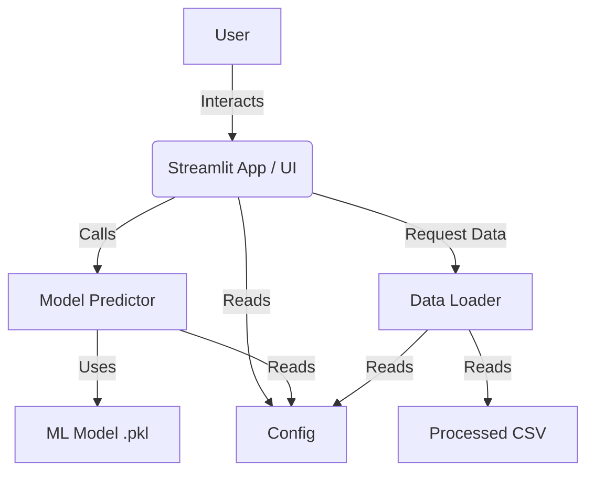

# 🚗 Car Price Prediction

A production-ready machine learning application for predicting used car prices. This project demonstrates a modular, scalable, and maintainable architecture suitable for deployment.

## 📋 Table of Contents
- [Overview](#overview)
- [Architecture](#architecture)
- [Installation](#installation)
- [Usage](#usage)
- [Configuration](#configuration)
- [Project Structure](#project-structure)

## 🧐 Overview
This application allows users to estimate the price of a used car based on various features such as brand, model, year, mileage, and improved condition specifics.

**Key Features:**
- Interactive Streamlit UI
- Modular Python codebase
- Configuration-driven architecture
- Robust logging
- Scalable model integration

## 🏗️ Architecture
The project follows a tiered architecture separating data, logic, and presentation:



## 🚀 Installation

1. **Clone the repository:**
   ```bash
   git clone <repo_url>
   cd car-price-prediction-app
   ```

2. **Install dependencies:**
   ```bash
   pip install -r requirements.txt
   # OR
   pip install -e .
   ```

## 🎮 Usage

Run the application using Streamlit:
```bash
streamlit run app/main.py
```

## ⚙️ Configuration
The application is configured via `config/config.yaml`. You can modify:
- Data paths
- Model parameters
- UI settings

## 📂 Project Structure
- `app/`: Streamlit application entry point
- `config/`: Configuration files
- `data/`: Data storage (processed/raw)
- `models/`: Saved ML models
- `src/`: Source code modules
  - `data/`: Data loading logic
  - `model/`: Inference logic
  - `utils/`: Utilities (logging, etc.)
- `tests/`: Unit and integration tests

## 🧪 Tests
Run tests using unittest:
```bash
python -m unittest discover tests
```

---
*Built with ❤️ by [Your Name]*
